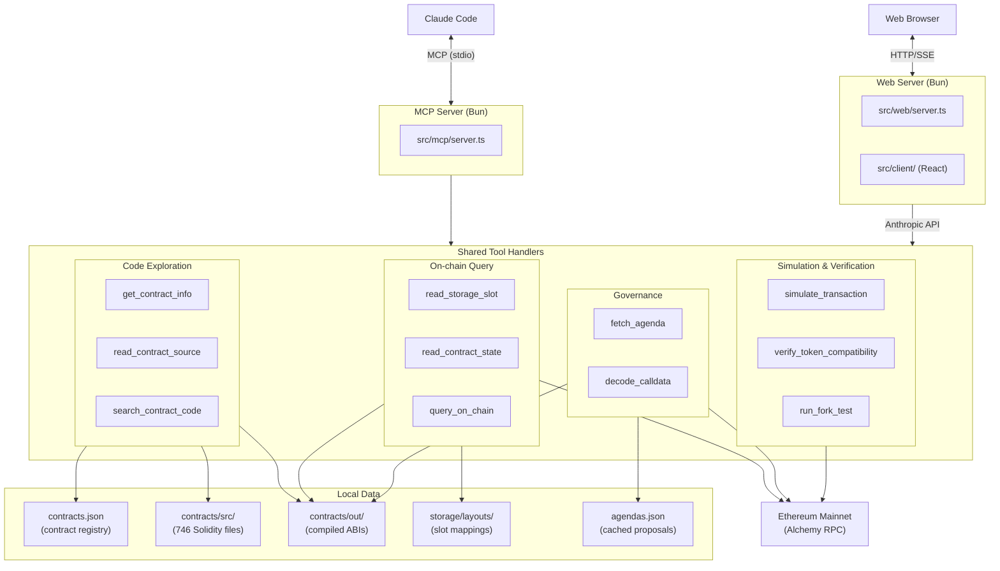

# Tokamak DAO Agent

An AI agent that analyzes Tokamak Network contracts and DAO governance.

Connected to Claude Code as an MCP (Model Context Protocol) server, it performs on-chain state queries, contract analysis, and proposal review through natural language conversation.

## Architecture



## Tools

| Tool | Description |
|------|-------------|
| `get_contract_info` | Look up contract address, type, and proxy relationships |
| `read_contract_source` | Read verified Solidity source code |
| `search_contract_code` | Search keywords across contract sources |
| `read_storage_slot` | Read raw storage slot data |
| `read_contract_state` | Decode full state via storage layouts |
| `query_on_chain` | Call view/pure functions |
| `fetch_agenda` | Fetch DAO proposal details |
| `decode_calldata` | Decode transaction calldata |
| `simulate_transaction` | Simulate transactions via eth_call |
| `verify_token_compatibility` | Verify token compatibility with DEX protocols |
| `run_fork_test` | Execute Foundry fork tests against mainnet |

## Setup

### Prerequisites

- [Bun](https://bun.sh) v1.3+
- Alchemy API key (Ethereum mainnet)

### Environment Variables

```bash
cp .env.example .env
```

Edit `.env` and fill in the required values:

| Variable | Required | Purpose |
|----------|----------|---------|
| `ALCHEMY_RPC_URL` | Yes | Ethereum mainnet RPC for on-chain queries |
| `ETHERSCAN_API_KEY` | For scripts | Fetching verified contract sources |
| `ANTHROPIC_API_KEY` | For chat UI | Anthropic API access |

### Install & Run

```bash
bun install
```

The MCP server is registered in `.claude/settings.json` and connects automatically when Claude Code starts.

Manual run:

```bash
bun run mcp        # MCP server (stdio, for Claude Code)
bun run dev:web    # Web chat server (hot reload)
bun run dev:client # Vite dev server for React frontend
```

### Contracts (Foundry)

```bash
cd contracts
forge build
```

## Project Structure

```
src/mcp/                  MCP server and tool handlers
src/web/                  Web chat server and system prompt
src/client/               React frontend (Vite)
contracts/src/             Verified Solidity sources (44 contracts)
contracts/out/             Compiled ABIs (Foundry)
contracts/test/            Fork tests (TON compatibility, etc.)
scripts/mainnet/
  ├── contracts.json       Contract registry
  └── agendas.json         Cached DAO proposal data
scripts/storage/
  ├── layouts/             Storage layout JSONs
  └── reader.ts            Storage reading utilities
```

## License

MIT
