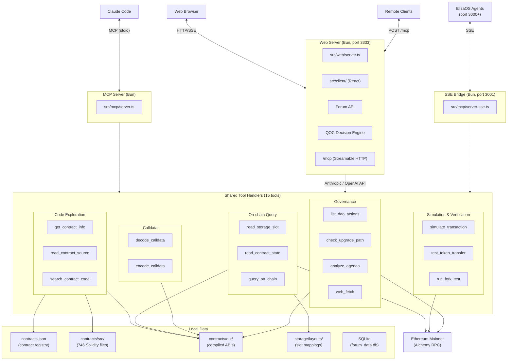

# Tokamak DAO Agent

An AI agent for Tokamak Network — combining MCP-based contract analysis, a multi-tab Web UI with chat and governance tools, and a QOC (Quality of Criteria) decision engine for structured proposal evaluation.

## Architecture


```mermaid
flowchart TB
    Claude["Claude Code"]
    Browser["Web Browser"]
    Remote["Remote Clients"]
    ElizaOS["ElizaOS Agents\n(port 3000+)"]

    Claude <-->|"MCP (stdio)"| MCP
    Browser <-->|"HTTP/SSE"| Web
    Remote <-->|"POST /mcp"| Web
    ElizaOS <-->|"SSE"| SSE

    subgraph MCP["MCP Server (Bun)"]
        direction LR
        mcp_entry["src/mcp/server.ts"]
    end

    subgraph Web["Web Server (Bun, port 3333)"]
        direction LR
        web_entry["src/web/server.ts"]
        web_client["src/client/ (React)"]
        forum_api["Forum API"]
        qoc_engine["QOC Decision Engine"]
        streamable_http["/mcp (Streamable HTTP)"]
    end

    subgraph SSE["SSE Bridge (Bun, port 3001)"]
        direction LR
        sse_entry["src/mcp/server-sse.ts"]
    end

    MCP --> Handlers
    Web -->|"Anthropic / OpenAI API"| Handlers
    SSE --> Handlers

    subgraph Handlers["Shared Tool Handlers (15 tools)"]
        direction TB

        subgraph tools1["Code Exploration"]
            get_contract_info
            read_contract_source
            search_contract_code
        end

        subgraph tools2["On-chain Query"]
            read_storage_slot
            read_contract_state
            query_on_chain
        end

        subgraph tools3["Calldata"]
            decode_calldata
            encode_calldata
        end

        subgraph tools4["Simulation & Verification"]
            simulate_transaction
            test_token_transfer
            run_fork_test
        end

        subgraph tools5["Governance"]
            list_dao_actions
            check_upgrade_path
            analyze_agenda
            web_fetch
        end
    end

    subgraph Data["Local Data"]
        contracts_json["contracts.json\n(contract registry)"]
        sources["contracts/src/\n(746 Solidity files)"]
        abis["contracts/out/\n(compiled ABIs)"]
        layouts["storage/layouts/\n(slot mappings)"]
        sqlite["SQLite\n(forum_data.db)"]
    end

    RPC["Ethereum Mainnet\n(Alchemy RPC)"]

    tools1 --> contracts_json & sources & abis
    tools2 --> layouts & abis & RPC
    tools3 --> abis
    tools4 --> RPC
    tools5 --> abis & RPC
```

## Tools

15 shared tools available across all interfaces (Claude Code, Web UI, SSE bridge, Streamable HTTP):

| Tool | Description |
|------|-------------|
| `get_contract_info` | Search Tokamak Network contracts by name or address. Returns address, type, proxy relationships, and related contracts |
| `read_contract_source` | Read verified Solidity source code for a Tokamak contract |
| `search_contract_code` | Search keywords across all Tokamak contract sources |
| `read_storage_slot` | Read a raw storage slot from any Ethereum contract |
| `read_contract_state` | Decode full state via storage layouts for known contracts |
| `query_on_chain` | Call view/pure functions on Tokamak Network contracts |
| `decode_calldata` | Decode raw transaction calldata using known ABIs |
| `encode_calldata` | Encode a function call into calldata for a DAO proposal |
| `simulate_transaction` | Simulate transactions via eth_call against mainnet state |
| `test_token_transfer` | Verify token compatibility with DEX protocols (approve, transferFrom, swap) |
| `run_fork_test` | Execute Foundry fork tests against Ethereum mainnet |
| `list_dao_actions` | List all DAO-callable contracts and their governance functions |
| `check_upgrade_path` | Check if a proxy contract can be upgraded by the DAO |
| `analyze_agenda` | Full agenda analysis: decode calldata, simulate execution, risk assessment |
| `web_fetch` | Fetch data from trusted DeFi APIs (DefiLlama, Etherscan, DexScreener, CoinGecko) |

## Web UI

A React single-page application with 5 tabs:

| Tab | Route | Purpose |
|-----|-------|---------|
| Chat | `/chat` | Free-form conversation with tool-calling AI agent |
| Generate Calldata | `/calldata` | Encode function calls for DAO proposals |
| Analyze Proposal | `/proposal` | Deep analysis of on-chain or draft proposals |
| Agents | `/agents` | ElizaOS agent management and group chat |
| Forum | `/forum` | Governance forum with QOC evaluation, agent opinions, and wallet-gated comments |

- **Provider support**: Anthropic and OpenAI APIs with per-request model selection
- **Streaming**: Server-Sent Events (SSE) for real-time tool execution feedback
- **Wallet connection**: WalletConnect/Reown for wallet-gated forum comments

## QOC Decision Engine

Structured proposal evaluation using 7 specialized criterion agents and 4 stakeholder lenses.

### 7 Criterion Agents

Each agent evaluates exactly one axis, producing a score from 0–100:

| Criterion | Agent | Focus |
|-----------|-------|-------|
| Technical Safety | TechSafety Analyst | Revert risks, fork test results, attack surface, side effects |
| Economic Impact | Economic Analyst | Staking yields, treasury effects, holder dilution |
| Governance Integrity | Governance Analyst | Power concentration, quorum changes, transparency |
| Operational Continuity | Operations Analyst | Staking flow, L2 operations, dependency chain |
| Strategic Alignment | Strategy Analyst | Roadmap alignment, ecosystem growth, competitive positioning |
| Reversibility | Reversibility Analyst | Rollback capability, setter functions, state irreversibility |
| Implementation Quality | Implementation Analyst | Calldata correctness, parameter accuracy, documentation |

### 4 Stakeholder Lenses

Pure math — each lens applies a weight vector (sum = 100) to the 7 criterion scores:

| Lens | Stakeholder | Top Weights |
|------|------------|-------------|
| Alpha | TON Holder | econImpact (30), stratAlign (20), techSafety (15) |
| Beta | L2 Operator | opsContinuity (30), techSafety (25), reversibility (15) |
| Gamma | Validator | techSafety (30), govIntegrity (20), econImpact (15) |
| Delta | Foundation | stratAlign (35), implQuality (20), econImpact (15) |

### Aggregation Flow

```
7 criterion scores → applyAllLenses() → 4 lens results → mean → final verdict
```

**Verdict thresholds:**

| Score | Verdict |
|-------|---------|
| 80+ | APPROVE |
| 65–79 | NEEDS_REVIEW |
| 50–64 | ABSTAIN |
| 35–49 | NEEDS_REVIEW |
| < 35 | REJECT |

**Hard veto**: If `techSafety < 20`, the proposal is forced to `REJECT` regardless of other scores.

### 2-Phase Deliberation

- **Phase 1**: 7 criterion agents evaluate independently (parallel)
- **Phase 2**: Meta-agent synthesis with ±10 score adjustments based on cross-criterion analysis

## Forum API

All routes are prefixed with `/api/forum`.

### Agendas

| Method | Route | Description |
|--------|-------|-------------|
| `POST` | `/agenda` | Create agenda (auto-triggers QOC + agent opinions) |
| `GET` | `/agenda` | List agendas (filter by status, sort, paginate) |
| `GET` | `/agenda/:id` | Get agenda with opinions and comments |
| `PATCH` | `/agenda/:id` | Edit draft/rejected agenda (re-triggers evaluation) |
| `GET` | `/agenda/next-tip-number` | Get next available TIP number |

### Opinions & Comments

| Method | Route | Description |
|--------|-------|-------------|
| `POST` | `/agenda/:id/opinion` | Submit agent opinion |
| `POST` | `/agenda/:id/opinion/request` | Request opinion from specific agent |
| `GET` | `/agenda/:id/opinions` | List opinions for agenda |
| `POST` | `/agenda/:id/comment` | Add wallet-gated comment |
| `GET` | `/agenda/:id/comments` | List comments |
| `PATCH` | `/agenda/:id/comment/:commentId` | Edit comment (author only) |
| `DELETE` | `/agenda/:id/comment/:commentId` | Delete comment (author only) |

### QOC Evaluation

| Method | Route | Description |
|--------|-------|-------------|
| `POST` | `/agenda/:id/qoc/evaluate` | Run full 7-criterion QOC evaluation |
| `POST` | `/agenda/:id/qoc/evaluate/:criterionId` | Run single criterion evaluation |
| `GET` | `/agenda/:id/qoc/evaluations` | Get criterion-level scores |
| `GET` | `/agenda/:id/qoc/result` | Get aggregated QOC result |

### Deliberation & Credibility

| Method | Route | Description |
|--------|-------|-------------|
| `POST` | `/agenda/:id/deliberate` | Run 2-phase deliberation protocol |
| `GET` | `/agenda/:id/deliberation` | Get deliberation rounds |
| `GET` | `/credibility` | Agent credibility summaries |
| `GET` | `/credibility/:agentName` | Individual agent history |
| `GET` | `/agenda/:id/credibility` | Credibility records for agenda |
| `POST` | `/agenda/:id/credibility/resolve` | Resolve predictions against outcome |

### Agents & Utilities

| Method | Route | Description |
|--------|-------|-------------|
| `GET` | `/agent` | List registered agents |
| `POST` | `/agent` | Register new agent |
| `DELETE` | `/agent/:id` | Delete agent |
| `GET` | `/agent/:agentName/pending-agendas` | Get agendas pending opinion |
| `GET` | `/agenda/:id/validations` | Get validation results |
| `GET` | `/agenda/:id/summary` | Generate AI summary of opinions |
| `POST` | `/translate` | Translate text |
| `POST` | `/sync` | Sync on-chain agendas from DAOAgendaManager |
| `POST` | `/webhook/subscribe` | Subscribe to webhook notifications |
| `POST` | `/webhook/new-agenda` | Notify subscribers of new agenda |

## Multi-Agent Forum

Four AI agents with distinct stakeholder perspectives provide opinions on DAO proposals.

| Character File | Stakeholder | Personality | Agent Name |
|----------------|------------|-------------|------------|
| `ton-holder-progressive.json` | TON Holder | Progressive | Agent Alpha |
| `l2-operator-conservative.json` | L2 Operator | Conservative | Agent Beta |
| `validator-defensive.json` | Validator | Defensive | Agent Gamma |
| `foundation-aggressive.json` | Foundation | Aggressive | Agent Delta |

**Flow:** Agenda created → QOC evaluation + 4 agent opinions triggered automatically → results displayed in Forum tab

<details>
<summary>ElizaOS Setup (optional external integration)</summary>

### ElizaOS Setup

#### 1. Start Tokamak Servers

```bash
# Terminal 1: Main web server (port 3333)
bun run start

# Terminal 2: SSE MCP server for ElizaOS (port 3001)
bun run mcp:sse
```

#### 2. Install ElizaOS & Plugins

```bash
bun i -g @elizaos/cli
npx elizaos plugins add @fleek-platform/eliza-plugin-mcp
```

#### 3. Start an Agent

```bash
export ANTHROPIC_API_KEY=sk-ant-...
npx elizaos start --character ./elizaos/characters/ton-holder-progressive.json
```

To run all 4 agents:

```bash
ELIZAOS_PORT=3000 npx elizaos start --character ./elizaos/characters/ton-holder-progressive.json
ELIZAOS_PORT=3002 npx elizaos start --character ./elizaos/characters/l2-operator-conservative.json
ELIZAOS_PORT=3004 npx elizaos start --character ./elizaos/characters/validator-defensive.json
ELIZAOS_PORT=3006 npx elizaos start --character ./elizaos/characters/foundation-aggressive.json
```

#### 4. Subscribe to Webhooks (Optional)

```bash
curl -X POST http://localhost:3333/api/forum/webhook/subscribe \
  -H "Content-Type: application/json" \
  -d '{"url": "http://localhost:3000/webhook/new-agenda", "label": "Agent Alpha"}'
```

The `elizaos/plugins/tokamak-forum/` plugin provides webhook handling and auto-opinion generation.

</details>

## Setup

### Prerequisites

- [Bun](https://bun.sh) v1.3+
- Alchemy API key (Ethereum mainnet)
- [Foundry](https://getfoundry.sh) (for fork tests)
- [Reown Project ID](https://cloud.reown.com) (for wallet connection in Forum, optional)
- [ElizaOS CLI](https://elizaos.github.io/eliza/) (optional, for external agent integration)

### Environment Variables

```bash
cp .env.example .env
```

| Variable | Required | Purpose |
|----------|----------|---------|
| `ALCHEMY_RPC_URL` | Yes | Ethereum mainnet RPC for on-chain queries |
| `ETHERSCAN_API_KEY` | For scripts | Fetching verified contract sources |
| `OPENAI_API_KEY` | For chat UI | OpenAI-compatible API access |
| `OPENAI_BASE_URL` | No | Custom OpenAI-compatible API endpoint |
| `ANTHROPIC_API_KEY` | No | Anthropic API access (alternative provider) |
| `ANTHROPIC_BASE_URL` | No | Custom Anthropic API endpoint |
| `CHAT_MODEL` | No | Default chat model (default: `gpt-5.2`) |
| `QOC_MODEL` | No | Model for QOC evaluation (default: `gpt-5.2`) |
| `OPINION_MODEL` | No | Model for agent opinions (default: `gemini-3-flash`) |
| `SUMMARY_MODEL` | No | Model for summary generation (default: `gemini-3-flash`) |
| `MCP_API_KEY` | No | Auth for SSE/Streamable HTTP MCP endpoints |
| `VITE_REOWN_PROJECT_ID` | No | Reown (WalletConnect) project ID for Forum |
| `AGENT_ALPHA_PK` .. `AGENT_DELTA_PK` | No | Agent wallet private keys (generate with `bun run generate-wallets`) |

### Install & Run

```bash
bun install
```

The MCP server is registered in `.claude/settings.json` and connects automatically when Claude Code starts.

```bash
bun run mcp           # MCP server (stdio, for Claude Code)
bun run start         # Web server (port 3333)
bun run dev:web       # Web server with hot reload
bun run dev:client    # Vite dev server for React frontend
bun run mcp:sse       # SSE bridge for ElizaOS (port 3001)
bun run start:all     # All services (web + SSE + ElizaOS agents)
bun run generate-wallets  # Generate agent wallet keys
```

## Database

SQLite database (`forum_data.db`) with 11 tables:

| Table | Purpose |
|-------|---------|
| `agendas` | DAO proposals with status tracking and on-chain sync |
| `opinions` | Agent opinions per agenda (verdict, reasoning, confidence) |
| `user_comments` | Wallet-gated user comments on agendas |
| `summaries` | AI-generated opinion summaries |
| `validations` | Proposal validation results |
| `qoc_criterion_evaluations` | Individual criterion scores (7 per agenda) |
| `qoc_results` | Aggregated QOC results (lens scores, verdict, hard veto) |
| `deliberation_rounds` | 2-phase deliberation records |
| `agent_credibility` | Prediction vs outcome tracking for agents |
| `agents` | Registered agent personas |
| `webhook_subscribers` | Webhook notification subscribers |

## Contracts & Fork Tests

44 verified Solidity contract trees (746+ files) in `contracts/src/`. 11 Foundry fork tests verify real on-chain behavior:

| Test File | Verifies |
|-----------|----------|
| `TONCompatibility.t.sol` | TON/WTON DEX compatibility (transferFrom restrictions) |
| `StakingDeposit.t.sol` | WTON deposit to Layer2 via DepositManager |
| `StakingWithdraw.t.sol` | Withdrawal request and processing with delay |
| `Seigniorage.t.sol` | SeigManager seigniorage distribution and view functions |
| `ApproveAndCall.t.sol` | Full TON→WTON→DepositManager callback chain |
| `StorageVerify.t.sol` | Storage layout verification against on-chain state |
| `DAOCommitteeRouting.t.sol` | Proxy selector routing (slot0/slot1 dispatch) |
| `DAOVotingLifecycle.t.sol` | Agenda creation → voting → execution lifecycle |
| `Layer2Registration.t.sol` | Layer2 contract registration and management |
| `AgendaSimulation.t.sol` | Agenda execution simulation as DAOCommitteeProxy |
| `CompileInterfaces.t.sol` | ABI interface compilation verification |

```bash
cd contracts
forge build                                                          # Build contracts
FOUNDRY_PROFILE=fork forge test --fork-url $ALCHEMY_RPC_URL          # Run all fork tests
FOUNDRY_PROFILE=fork forge test --match-test test_TON --fork-url $ALCHEMY_RPC_URL  # Run specific test
```

## Deployment

### Docker Compose

```bash
docker-compose up --build
```

Two services:
- **web**: Main web server + SSE bridge + Foundry (ports 3333, 3001)
- **elizaos**: ElizaOS agent runtime (port 3000)

### Fly.io

Deployed to `nrt` region (Tokyo) with:
- 512MB shared CPU
- Persistent volume at `/data` for SQLite
- Health checks on `/api/health` and `/health`
- Two-stage Dockerfile: Vite build → Bun runtime with Foundry

```bash
fly deploy
```

## Project Structure

```
src/
├── config.ts                Shared constants (models, token limits)
├── mcp/
│   ├── server.ts            MCP server entry (stdio transport)
│   ├── server-sse.ts        SSE bridge for ElizaOS agents
│   ├── client.ts            viem public client instance
│   ├── paths.ts             Path resolution utilities
│   ├── data/                Contract registry, ABI, DEX protocol configs
│   └── tools/               15 tool handlers + validation + dispatcher
│       ├── handlers.ts      Unified tool registry and executeTool()
│       ├── index.ts         MCP server tool registration
│       ├── validation.ts    Input validation utilities
│       ├── contract-info.ts
│       ├── contract-source.ts
│       ├── storage.ts
│       ├── on-chain.ts
│       ├── governance.ts    decode_calldata handler
│       ├── encode.ts        encode_calldata handler
│       ├── simulation.ts
│       ├── verification.ts  test_token_transfer handler
│       ├── fork-test.ts
│       ├── dao-actions-tool.ts
│       ├── upgrade-path.ts
│       ├── agenda-analysis.ts
│       └── web-fetch.ts
├── db/
│   ├── index.ts             SQLite connection and initialization
│   ├── schema.ts            DDL for 11 tables
│   ├── agendas.ts           Agenda CRUD
│   ├── opinions.ts          Opinion CRUD
│   ├── comments.ts          Comment CRUD
│   ├── validations.ts       Validation records
│   ├── agents.ts            Agent registration
│   └── qoc.ts               QOC evaluation and result storage
├── web/
│   ├── server.ts            Web server (Hono + SSE streaming + Streamable HTTP MCP)
│   ├── forum.ts             Forum API router (32 endpoints)
│   ├── forum-validation.ts  Input validation for forum endpoints
│   ├── forum-summary.ts     AI summary generation
│   ├── forum-agents.ts      Agent opinion generation
│   ├── forum-deliberation.ts 2-phase deliberation protocol
│   ├── forum-translate.ts   Text translation
│   ├── forum-validators.ts  Proposal content validators
│   ├── agenda-sync.ts       On-chain agenda sync from DAOAgendaManager
│   ├── agent-credibility.ts Prediction vs outcome tracking
│   ├── agent-wallets.ts     Agent wallet management
│   ├── qoc-types.ts         QOC type definitions
│   ├── qoc-weights.ts       7 criteria + 4 lens weight profiles
│   ├── qoc-aggregation.ts   Score aggregation engine
│   ├── qoc-agents.ts        Criterion agent execution
│   ├── qoc-aggregation.test.ts  27 unit tests
│   ├── system-prompt.ts     AI system prompt (verification-first)
│   ├── elizaos.ts           ElizaOS integration endpoints
│   ├── elizaos-socket.ts    Socket.IO client (for future use)
│   └── providers/
│       ├── types.ts         ChatProvider interface
│       ├── index.ts         Provider detection and factory
│       ├── anthropic.ts     Anthropic API provider
│       └── openai.ts        OpenAI API provider
└── client/                  React frontend (Vite)
    ├── App.tsx              Router with 5 tabs
    ├── main.tsx             Entry point
    ├── components/
    │   ├── Chat.tsx         Main chat interface
    │   ├── ChatInterface.tsx Chat with tool display
    │   ├── MakeProposalTab.tsx  Calldata generation
    │   ├── AnalyzeProposalTab.tsx  Proposal analysis
    │   ├── AgentsTab.tsx    Agent management
    │   ├── ForumTab.tsx     Governance forum
    │   ├── TabBar.tsx       Navigation
    │   ├── AgentChatPanel.tsx
    │   ├── AgentCreator.tsx
    │   ├── GroupChatPicker.tsx
    │   └── chat/            Chat sub-components
    └── contexts/            React contexts (Tab, Agent, ElizaOS, Wallet)
elizaos/
├── characters/              4 agent persona definitions
└── plugins/
    └── tokamak-forum/       Webhook receiver + opinion submission plugin
contracts/
├── src/                     Verified Solidity sources (44 contracts, 746+ files)
├── out/                     Compiled ABIs (Foundry)
├── test/                    11 fork tests
└── lib/                     Foundry dependencies
scripts/
├── mainnet/
│   └── contracts.json       Contract registry (addresses, types, proxy relationships)
└── storage/
    ├── layouts/             Storage layout JSONs (40 files)
    └── reader.ts            Storage reading utilities
```

## License

MIT
