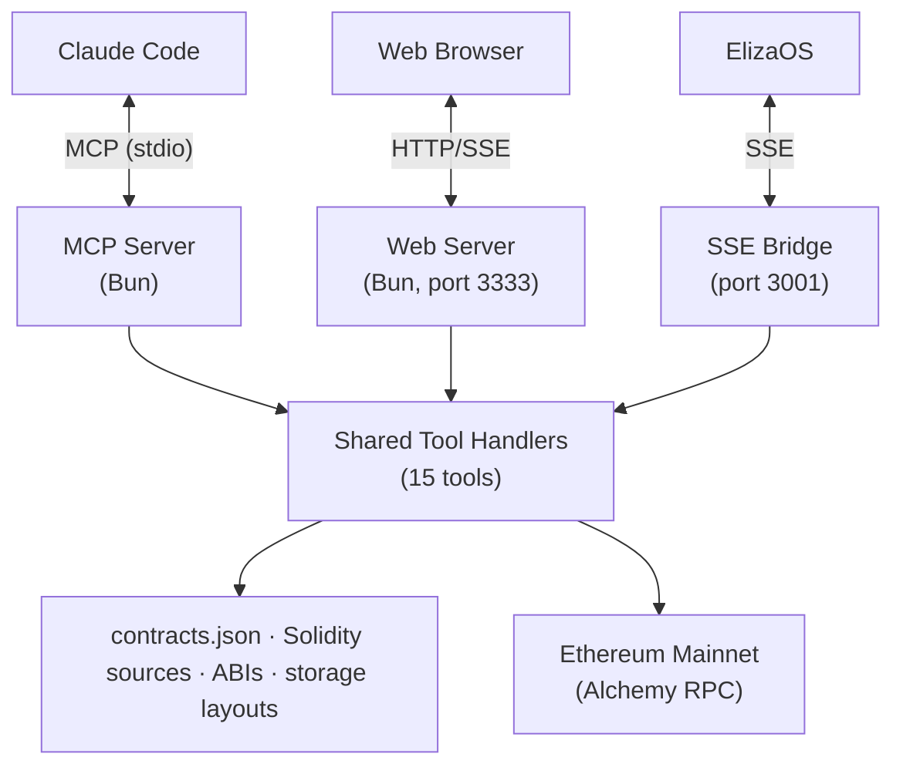

# Tokamak DAO Agent

AI agent for analyzing Tokamak Network contracts and participating in DAO governance.

## Architecture


```mermaid
flowchart TB
    Claude["Claude Code"] <-->|"MCP (stdio)"| MCP["MCP Server<br/>(Bun)"]
    Browser["Web Browser"] <-->|"HTTP/SSE"| Web["Web Server<br/>(Bun, port 3333)"]
    ElizaOS["ElizaOS"] <-->|"SSE"| SSE["SSE Bridge<br/>(port 3001)"]

    MCP & Web & SSE --> Handlers["Shared Tool Handlers<br/>(15 tools)"]

    Handlers --> Data["contracts.json · Solidity sources · ABIs · storage layouts"]
    Handlers --> RPC["Ethereum Mainnet<br/>(Alchemy RPC)"]
```

## Tools

15 shared tools available across all interfaces:

| Tool | Description |
|------|-------------|
| `get_contract_info` | Search contracts by name or address. Returns address, type, proxy relationships |
| `read_contract_source` | Read verified Solidity source code |
| `search_contract_code` | Search keywords across all contract sources |
| `read_storage_slot` | Read a raw storage slot from any Ethereum contract |
| `read_contract_state` | Decode full state via storage layouts |
| `query_on_chain` | Call view/pure functions on contracts |
| `decode_calldata` | Decode raw transaction calldata using known ABIs |
| `encode_calldata` | Encode a function call into calldata for a DAO proposal |
| `simulate_transaction` | Simulate transactions via `eth_call` against mainnet |
| `test_token_transfer` | Verify token compatibility with DEX protocols |
| `run_fork_test` | Execute Foundry fork tests against mainnet |
| `list_dao_actions` | List DAO-callable contracts and governance functions |
| `check_upgrade_path` | Check if a proxy can be upgraded by the DAO |
| `analyze_agenda` | Decode calldata, simulate execution, assess risk |
| `web_fetch` | Fetch data from trusted DeFi APIs |

## Setup

### Prerequisites

- [Bun](https://bun.sh) v1.3+
- [Foundry](https://getfoundry.sh) (for fork tests)
- Alchemy API key (Ethereum mainnet)

### Environment Variables

```bash
cp .env.example .env
```

| Variable | Required | Purpose |
|----------|----------|---------|
| `ALCHEMY_RPC_URL` | Yes | Ethereum mainnet RPC |
| `OPENAI_API_KEY` | For Web UI | OpenAI-compatible API access |
| `ANTHROPIC_API_KEY` | No | Anthropic API (alternative provider) |
| `QOC_MODEL` | No | Model for QOC evaluation (default: `gpt-5.2`) |
| `VITE_REOWN_PROJECT_ID` | No | WalletConnect for Forum comments |

See `.env.example` for the full list.

### Install & Run

```bash
bun install

bun run mcp           # MCP server (stdio, for Claude Code)
bun run start         # Web server (port 3333)
bun run dev:web       # Web server with hot reload
```

### Fork Tests

```bash
cd contracts
FOUNDRY_PROFILE=fork forge test --fork-url $ALCHEMY_RPC_URL
```

## Deployment

### Docker Compose

```bash
docker-compose up --build
```

### Fly.io

```bash
fly deploy
```

## License

MIT
