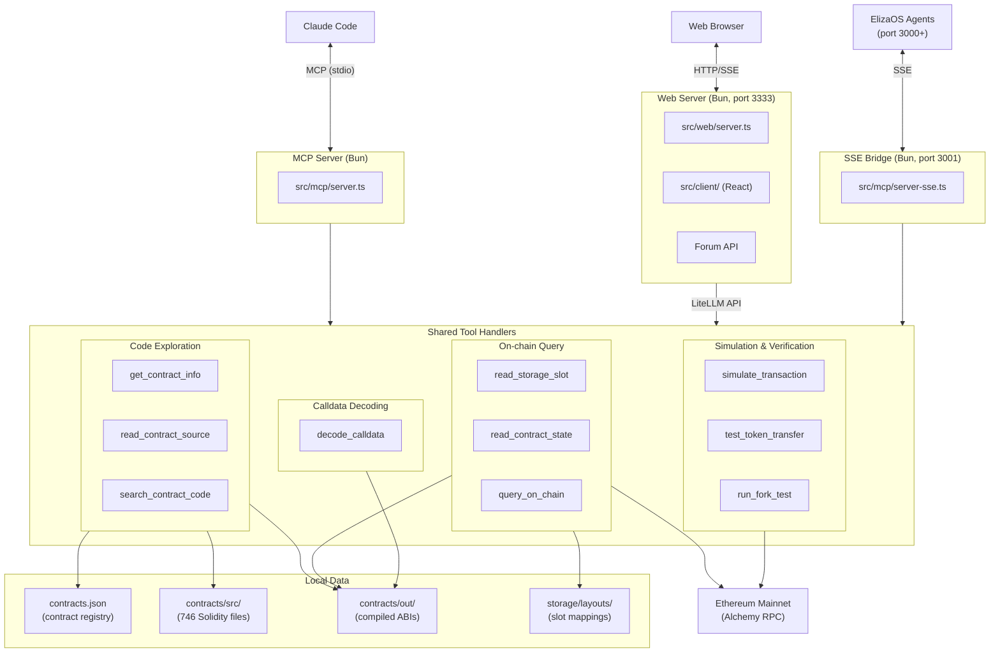

# Tokamak DAO Agent

An AI agent that analyzes Tokamak Network contracts and DAO governance — from single-user contract analysis to multi-agent governance forum simulation.

Connected to Claude Code as an MCP (Model Context Protocol) server, it performs on-chain state queries, contract analysis, and proposal review through natural language conversation. A multi-agent forum powered by ElizaOS simulates stakeholder debates on DAO proposals.

## Architecture


```mermaid
flowchart TB
    Claude["Claude Code"]
    Browser["Web Browser"]
    ElizaOS["ElizaOS Agents\n(port 3000+)"]

    Claude <-->|"MCP (stdio)"| MCP
    Browser <-->|"HTTP/SSE"| Web
    ElizaOS <-->|"SSE"| SSE

    subgraph MCP["MCP Server (Bun)"]
        direction LR
        mcp_entry["src/mcp/server.ts"]
    end

    subgraph Web["Web Server (Bun, port 3333)"]
        direction LR
        web_entry["src/web/server.ts"]
        web_client["src/client/ (React)"]
        forum_api["Forum API"]
    end

    subgraph SSE["SSE Bridge (Bun, port 3001)"]
        direction LR
        sse_entry["src/mcp/server-sse.ts"]
    end

    MCP --> Handlers
    Web -->|"LiteLLM API"| Handlers
    SSE --> Handlers

    subgraph Handlers["Shared Tool Handlers"]
        direction TB

        subgraph tools1["Code Exploration"]
            get_contract_info
            read_contract_source
            search_contract_code
        end

        subgraph tools2["On-chain Query"]
            read_storage_slot
            read_contract_state
            query_on_chain
        end

        subgraph tools3["Calldata Decoding"]
            decode_calldata
        end

        subgraph tools4["Simulation & Verification"]
            simulate_transaction
            test_token_transfer
            run_fork_test
        end
    end

    subgraph Data["Local Data"]
        contracts_json["contracts.json\n(contract registry)"]
        sources["contracts/src/\n(746 Solidity files)"]
        abis["contracts/out/\n(compiled ABIs)"]
        layouts["storage/layouts/\n(slot mappings)"]
    end

    RPC["Ethereum Mainnet\n(Alchemy RPC)"]

    tools1 --> contracts_json & sources & abis
    tools2 --> layouts & abis & RPC
    tools3 --> abis
    tools4 --> RPC
```

## Tools

| Tool | Description |
|------|-------------|
| `get_contract_info` | Look up contract address, type, and proxy relationships |
| `read_contract_source` | Read verified Solidity source code |
| `search_contract_code` | Search keywords across contract sources |
| `read_storage_slot` | Read raw storage slot data |
| `read_contract_state` | Decode full state via storage layouts |
| `query_on_chain` | Call view/pure functions |
| `decode_calldata` | Decode transaction calldata |
| `simulate_transaction` | Simulate transactions via eth_call |
| `test_token_transfer` | Verify token compatibility with DEX protocols |
| `run_fork_test` | Execute Foundry fork tests against mainnet |

## Multi-Agent Forum

Four AI agents with distinct stakeholder perspectives debate DAO proposals autonomously via [ElizaOS](https://elizaos.github.io/eliza/).

| Character File | Stakeholder | Personality | Agent Name |
|----------------|------------|-------------|------------|
| `ton-holder-progressive.json` | TON Holder | Progressive | Agent Alpha |
| `l2-operator-conservative.json` | L2 Operator | Conservative | Agent Beta |
| `validator-defensive.json` | Validator | Defensive | Agent Gamma |
| `foundation-aggressive.json` | Foundation | Aggressive | Agent Delta |

**Flow:** Agenda created → webhook notifies agents → each agent analyzes using MCP tools → opinions submitted to forum

Each agent connects to the SSE bridge to access on-chain tools, and uses the `tokamak-forum` plugin to receive webhooks and submit opinions.

### ElizaOS Setup

#### 1. Start Tokamak Servers

```bash
# Terminal 1: Main web server (port 3333)
bun run start

# Terminal 2: SSE MCP server for ElizaOS (port 3001)
bun run mcp:sse
```

Verify servers are running:

```bash
curl http://localhost:3333/api/health
curl http://localhost:3001/health
```

#### 2. Install ElizaOS & Plugins

```bash
bun i -g @elizaos/cli
npx elizaos plugins add @fleek-platform/eliza-plugin-mcp
```

#### 3. Start an Agent

```bash
export ANTHROPIC_API_KEY=sk-ant-...
npx elizaos start --character ./elizaos/characters/ton-holder-progressive.json
```

To run all 4 agents simultaneously:

```bash
ELIZAOS_PORT=3000 npx elizaos start --character ./elizaos/characters/ton-holder-progressive.json
ELIZAOS_PORT=3002 npx elizaos start --character ./elizaos/characters/l2-operator-conservative.json
ELIZAOS_PORT=3004 npx elizaos start --character ./elizaos/characters/validator-defensive.json
ELIZAOS_PORT=3006 npx elizaos start --character ./elizaos/characters/foundation-aggressive.json
```

#### 4. Subscribe to Webhooks (Optional)

```bash
curl -X POST http://localhost:3333/forum/webhook/subscribe \
  -H "Content-Type: application/json" \
  -d '{"url": "http://localhost:3000/webhook/new-agenda", "label": "Agent Alpha"}'
```

Agents can also poll instead: `GET /api/forum/agent/{agent_id}/pending-agendas`

#### 5. Verify the Full Flow

```bash
# Create an agenda
curl -X POST http://localhost:3333/api/forum/agenda \
  -H "Content-Type: application/json" \
  -d '{
    "title": "SeigManager parameter update proposal",
    "content": "Proposal to adjust seigniorage distribution from 40% to 50%.",
    "deadline": "2026-03-01T00:00:00Z",
    "creator": "test"
  }'

# Check opinions
curl http://localhost:3333/api/forum/agenda/1/opinions
```

### Tokamak Forum Plugin

The `elizaos/plugins/tokamak-forum/` plugin provides:

- **Webhook route** (`POST /webhook/new-agenda`): Receives agenda notifications and auto-generates opinions
- **ANALYZE_AGENDA action**: Manually trigger agenda analysis via chat (e.g., "agenda #5 분석해줘")

## Setup

### Prerequisites

- [Bun](https://bun.sh) v1.3+
- Alchemy API key (Ethereum mainnet)
- [ElizaOS CLI](https://elizaos.github.io/eliza/) (for multi-agent forum)

### Environment Variables

```bash
cp .env.example .env
```

Edit `.env` and fill in the required values:

| Variable | Required | Purpose |
|----------|----------|---------|
| `ALCHEMY_RPC_URL` | Yes | Ethereum mainnet RPC for on-chain queries |
| `ETHERSCAN_API_KEY` | For scripts | Fetching verified contract sources |
| `OPENAI_API_KEY` | For chat UI | LiteLLM / OpenAI-compatible API access |
| `OPENAI_BASE_URL` | No | Custom API endpoint |
| `ANTHROPIC_API_KEY` | No | Anthropic API access (alternative provider) |
| `MCP_API_KEY` | No | Auth for SSE MCP endpoint |

### Install & Run

```bash
bun install
```

The MCP server is registered in `.claude/settings.json` and connects automatically when Claude Code starts.

```bash
bun run mcp         # MCP server (stdio, for Claude Code)
bun run start       # Web server (port 3333)
bun run dev:web     # Web server with hot reload
bun run dev:client  # Vite dev server for React frontend
bun run mcp:sse     # SSE bridge for ElizaOS (port 3001)
```

To start ElizaOS agents (requires separate install):

```bash
npx elizaos start --character ./elizaos/characters/ton-holder-progressive.json
```

### Contracts (Foundry)

```bash
cd contracts
forge build
```

## Project Structure

```
src/
├── config.ts              Shared constants (models, token limits, etc.)
├── mcp/
│   ├── server.ts          MCP server entry (stdio transport)
│   ├── server-sse.ts      SSE bridge for ElizaOS agents
│   ├── client.ts          viem public client instance
│   ├── paths.ts           Path resolution utilities
│   ├── data/              Contract registry, ABI, DEX protocol configs
│   └── tools/             10 tool handlers + validation + dispatcher
├── web/
│   ├── server.ts          Web server (Hono + SSE streaming)
│   ├── forum.ts           Forum API (agendas, opinions, validation)
│   ├── elizaos.ts         ElizaOS integration endpoints
│   └── system-prompt.ts   AI system prompt (verification-first rule)
└── client/                React frontend (Vite)
elizaos/
├── characters/            4 agent persona definitions
└── plugins/
    └── tokamak-forum/     Webhook receiver + opinion submission plugin
contracts/
├── src/                   Verified Solidity sources (42 contracts, 746 files)
├── out/                   Compiled ABIs (Foundry)
└── test/                  Fork tests (staking, seigniorage, DEX compatibility)
scripts/
├── mainnet/
│   └── contracts.json     Contract registry (addresses, types, proxy relationships)
└── storage/
    ├── layouts/           Storage layout JSONs (40 files)
    └── reader.ts          Storage reading utilities
```

## License

MIT
